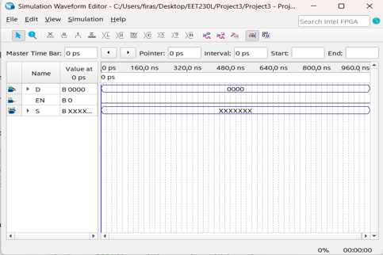
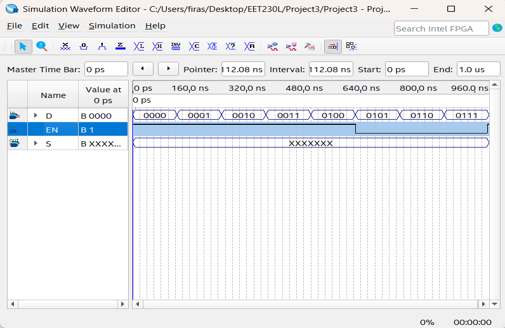
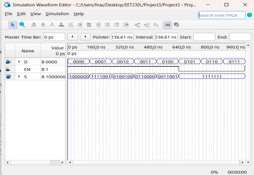
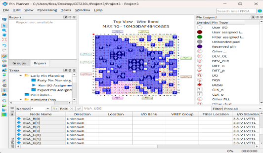
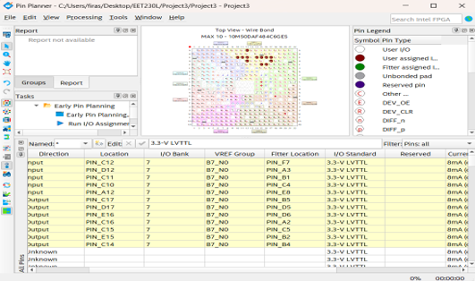
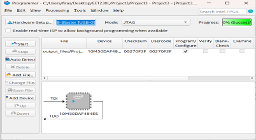

# Project 001 – FPGA 7-Segment Display Driver Screenshots

## Overview   

This folder contains screenshots documenting the design, simulation, pin assignment, compilation, and FPGA programming stages of **Project 001 – FPGA 7-Segment Display Driver Using VHDL**.

The screenshots provide visual evidence of the complete development workflow performed in **Intel Quartus Prime Lite**, from the top-level digital design through simulation and implementation on the **Terasic DE10-Lite FPGA Development Board**.

The screenshots demonstrate:

- Top-level FPGA schematic design
- VHDL module integration
- Waveform test configuration
- Functional simulation
- FPGA pin assignments
- Device configuration
- Compilation and implementation
- USB-Blaster/JTAG programming

---

# Screenshot 1 – Top-Level Quartus Schematic

## File

`Picture1.png`



## Description

This screenshot shows the top-level **Block Diagram/Schematic** developed in Quartus Prime Lite.

The design contains:

- `D[3..0]` – 4-bit digital input
- `EN` – Enable input
- `SSD` – 7-segment display-driver module
- `S[6..0]` – 7-bit segment-control output

The `SSD` block represents the VHDL display-driver module that was converted into a Quartus symbol and incorporated into the graphical top-level design.

### Signal Flow

```text
D[3..0] ─────┐
              │
              ▼
          ┌─────────┐
EN ──────►│   SSD   │──────► S[6..0]
          └─────────┘
```

This stage demonstrates how the VHDL module was integrated into the complete FPGA design.

---

# Screenshot 2 – Waveform Test Setup

## File

`Picture2.png`



## Description

This screenshot shows the **Quartus waveform configuration** used to prepare the FPGA design for functional simulation.

The waveform includes the principal design signals:

- `D[3..0]`
- `EN`
- `S[6..0]`

Different digital input conditions were configured across the simulation timeline.

This allowed the 7-segment display-driver logic to be tested under multiple input conditions before programming the physical FPGA.

### Simulation Process

1. Add the design signals to the waveform.
2. Configure the simulation time.
3. Apply test values to `D[3..0]`.
4. Configure the `EN` signal.
5. Run the functional simulation.
6. Observe the resulting `S[6..0]` output.

---

# Screenshot 3 – Functional Simulation Results

## File

`Picture3.png`



## Description

This screenshot shows the **functional simulation results** for the 7-segment display-driver design.

The output bus:

`S[6..0]`

changes according to the values applied to:

`D[3..0]`

and the state of:

`EN`

The simulation was used to verify the digital logic before transferring the design to the physical DE10-Lite FPGA board.

### Verification Flow

```text
D[3..0]
   +
  EN
   |
   v
SSD VHDL Logic
   |
   v
S[6..0]
   |
   v
Waveform Verification
```

The simulation stage provided software-based verification of the VHDL design before hardware implementation.

---

# Screenshot 4 – FPGA Pin Planner

## File

`Picture4.png`



## Description

This screenshot shows the **Quartus Prime Lite Pin Planner** used to connect the logical FPGA signals to physical pins on the DE10-Lite development board.

The logical signals include:

- `D[3..0]`
- `EN`
- `S[6..0]`

The pin assignments connect the FPGA design to physical board resources such as:

- On-board switches
- Enable input
- 7-segment display segments

This stage is essential because the VHDL design uses logical signal names, while the physical DE10-Lite board requires those signals to be mapped to specific FPGA pins.

### Hardware Mapping Process

```text
VHDL Signal
     |
     v
Quartus Pin Planner
     |
     v
MAX 10 FPGA Pin
     |
     v
DE10-Lite Hardware
     |
     v
Switch / 7-Segment Display
```

The completed assignments are stored as part of the Quartus project configuration.

---

# Screenshot 5 – Quartus Implementation and Device Configuration

## File

`Picture5.png`



## Description

This screenshot documents the Quartus project during the FPGA implementation and device-configuration stage.

The design targets the **Intel MAX 10 FPGA** installed on the Terasic DE10-Lite board.

The configured FPGA device is:

`10M50DAF484C6GES`

At this stage, Quartus processes the completed digital design and prepares it for implementation on the selected FPGA.

The compilation and implementation process verifies areas including:

- VHDL syntax
- Design hierarchy
- Signal connectivity
- FPGA device compatibility
- Pin assignments
- Logic implementation
- Hardware resource utilization

Successful completion of this stage prepares the FPGA design for programming.

---

# Screenshot 6 – Quartus Programmer and FPGA Programming

## File

`Picture6.png`



## Description

This screenshot shows **Quartus Programmer** being used to transfer the compiled FPGA design to the DE10-Lite development board.

The programming setup uses:

- **Hardware Interface:** USB-Blaster
- **Programming Mode:** JTAG
- **Target Hardware:** Terasic DE10-Lite
- **FPGA Family:** Intel MAX 10

The USB-Blaster interface establishes communication between Quartus Prime Lite and the FPGA development board.

The compiled FPGA configuration is then transferred to the MAX 10 FPGA.

This stage represents the transition from software-based design and simulation to physical FPGA implementation.

### Programming Flow

```text
Compiled FPGA Design
        |
        v
Quartus Programmer
        |
        v
USB-Blaster
        |
        v
JTAG Interface
        |
        v
Intel MAX 10 FPGA
        |
        v
DE10-Lite Hardware
```

---

# Complete FPGA Development Process

The six screenshots collectively document the major stages of the FPGA development workflow used in this project.

```text
VHDL Development
    SSD.vhd
       |
       v
Symbol Generation
    SSD.bsf
       |
       v
Top-Level Design
   Project3.bdf
       |
       v
Waveform Setup
   Waveform.vwf
       |
       v
Functional Simulation
       |
       v
Waveform Verification
       |
       v
FPGA Pin Assignment
       |
       v
Project Compilation
       |
       v
Device Configuration
       |
       v
Quartus Programmer
       |
       v
USB-Blaster / JTAG
       |
       v
Intel MAX 10 FPGA
       |
       v
DE10-Lite Hardware Testing
```

---

# Screenshot Summary

| Screenshot | Development Stage | Demonstration |
|---|---|---|
| `Picture1.png` | Design | Top-level Quartus Block Diagram/Schematic |
| `Picture2.png` | Simulation Setup | Waveform test configuration |
| `Picture3.png` | Verification | Functional simulation results |
| `Picture4.png` | Hardware Configuration | FPGA Pin Planner and I/O assignments |
| `Picture5.png` | Implementation | Quartus device configuration and implementation |
| `Picture6.png` | Programming | USB-Blaster/JTAG FPGA programming |

---

# Design Signals

The screenshots document the three primary signal groups used by the FPGA design.

| Signal | Direction | Width | Purpose |
|---|---|---:|---|
| `D[3..0]` | Input | 4 bits | Provides the digital value to the display driver |
| `EN` | Input | 1 bit | Enables or disables the display-driver output |
| `S[6..0]` | Output | 7 bits | Controls the seven segments of the display |

---

# Testing and Verification

The screenshots provide evidence of both **software-level verification** and preparation for **hardware-level verification**.

## Software Verification

The waveform simulation was used to:

1. Apply different digital input values.
2. Control the enable signal.
3. Observe the output bus.
4. Verify the VHDL logic.
5. Identify problems before hardware programming.

## Hardware Implementation

After simulation, the project progressed through:

1. FPGA pin assignment.
2. Device configuration.
3. Project compilation.
4. USB-Blaster connection.
5. JTAG programming.
6. Physical DE10-Lite testing.

This structured process reduces the risk of implementing an unverified digital design directly on the FPGA.

---

# Skills Demonstrated

## FPGA Design

- FPGA Development
- Digital Logic Design
- VHDL Integration
- 7-Segment Display Control
- Combinational Logic
- Digital Input/Output
- FPGA I/O Mapping

## Quartus Prime Lite

- Block Diagram/Schematic Editor
- Symbol Integration
- Waveform Editor
- Functional Simulation
- Waveform Analysis
- Pin Planner
- FPGA Device Configuration
- Compilation
- Quartus Programmer

## Hardware Implementation

- Terasic DE10-Lite
- Intel MAX 10 FPGA
- Physical Pin Assignment
- USB-Blaster
- JTAG Programming
- FPGA Programming
- Hardware Testing

## Engineering

- Design Verification
- Simulation
- Testing and Validation
- Troubleshooting
- Hardware/Software Integration
- Systematic Problem Solving
- Technical Documentation

---

# Related Project Files

## Main Project Documentation

[Project 001 Main README](../README.md)

## Quartus Source Files

[Quartus Source Files](../Quartus/)

The Quartus folder contains the VHDL source, top-level schematic, project configuration, simulation waveform, and other design files.

## Hardware Demonstration

[DE10-Lite Hardware Demonstration](../Hardware/)

The Hardware folder contains the physical DE10-Lite board demonstration.

## Project Documentation

[Supporting Documentation](../Documentation/)

The Documentation folder contains supporting laboratory documentation associated with the project.

---

# Purpose of This Folder

This folder provides visual documentation of the complete FPGA development process used in Project 001.

The screenshots demonstrate the progression from a digital design in Quartus Prime Lite through functional simulation, pin assignment, FPGA implementation, and hardware programming.

Together with the Quartus source files and DE10-Lite hardware demonstration, these screenshots provide evidence of practical experience with **VHDL, FPGA development, simulation, digital-system verification, pin mapping, JTAG programming, and physical FPGA implementation**.
