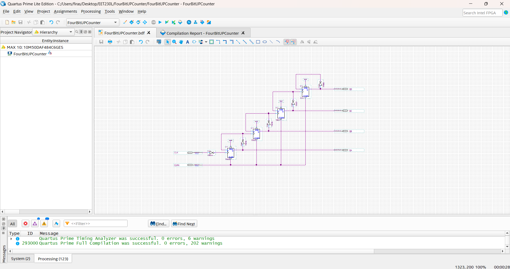
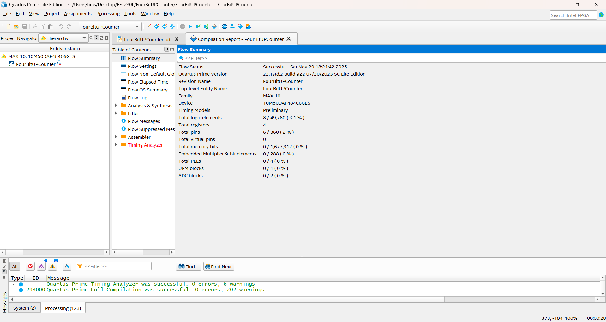
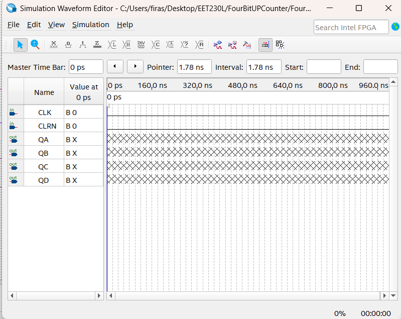
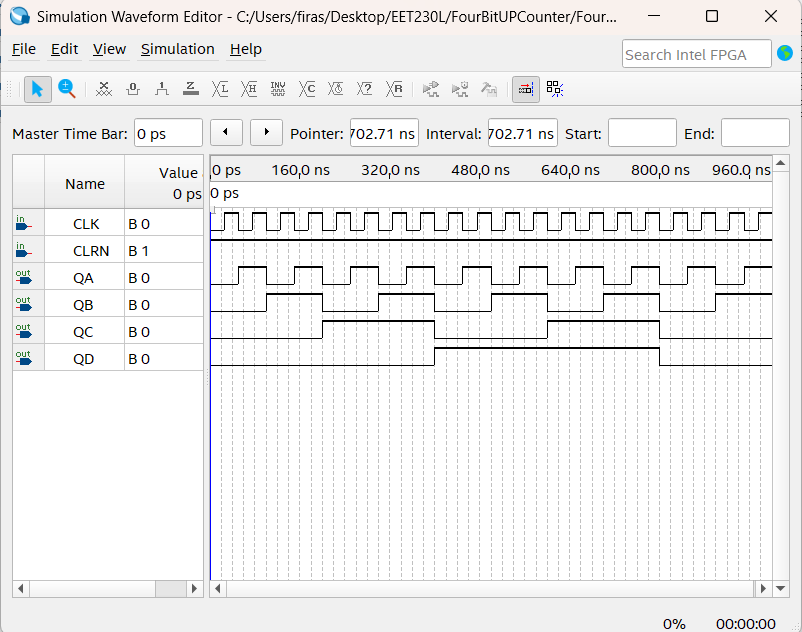
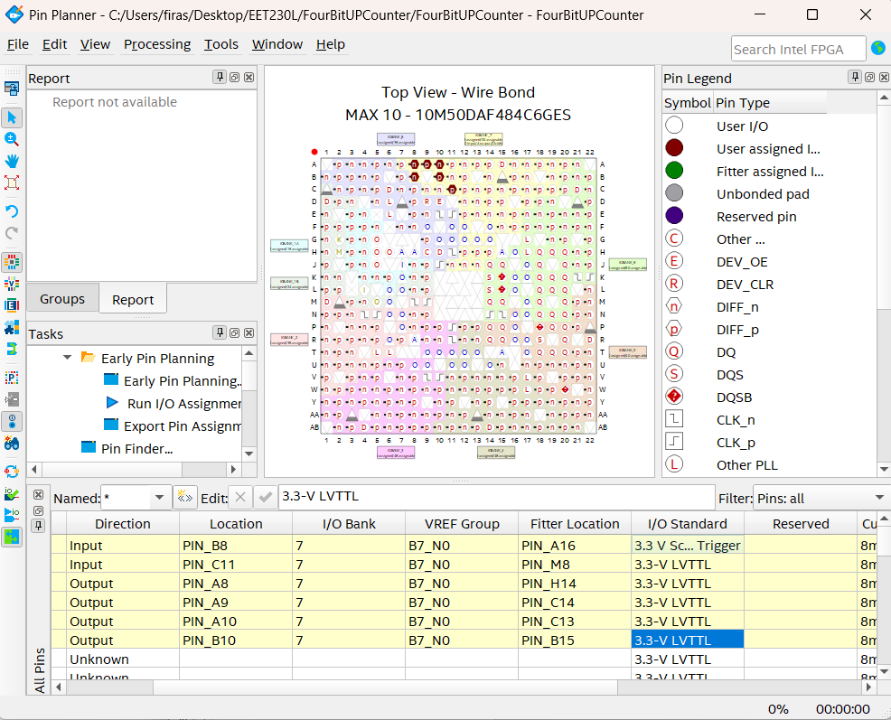
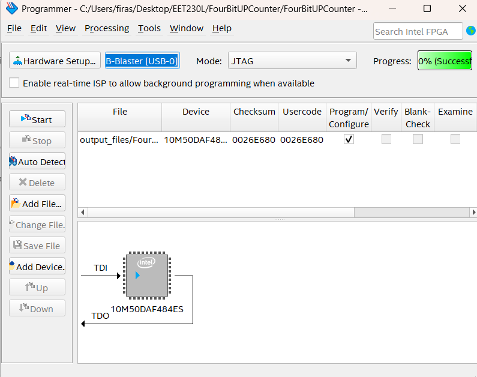

# Project 002 – Development Screenshots

## Overview

This folder contains screenshots documenting the development, simulation, compilation, pin assignment, and FPGA programming stages of **Project 002 – FPGA 4-Bit Up Counter**.

The screenshots provide visual evidence of the complete Quartus Prime Lite development workflow.

---

# Screenshot 1 – 4-Bit Counter Schematic

## File

[`Picture1.png`](Picture1.png)

## Description

This screenshot shows the completed 4-bit up-counter schematic in the Quartus Block Diagram/Schematic Editor.

The design includes:

- `CLK` input
- `CLRN` input
- Four flip-flop stages
- Feedback and inversion logic
- `QA` output
- `QB` output
- `QC` output
- `QD` output

The screenshot also shows that the Quartus compilation completed successfully with zero errors.

## Screenshot



---

# Screenshot 2 – Compilation Report

## File

[`Picture2.png`](Picture2.png)

## Description

This screenshot shows the Quartus **Flow Summary** after successful compilation.

The report identifies:

```text
Revision Name: FourBitUPCounter
Top-Level Entity: FourBitUPCounter
Family: MAX 10
Device: 10M50DAF484C6GES
```

The report also shows:

```text
Total Logic Elements: 8
Total Registers: 4
Total Pins: 6
```

The Flow Status is reported as successful.

## Screenshot



---

# Screenshot 3 – Initial Simulation Waveform

## File

[`Picture3.png`](Picture3.png)

## Description

This screenshot shows the initial waveform configuration in the Quartus Simulation Waveform Editor.

The following signals are included:

```text
CLK
CLRN
QA
QB
QC
QD
```

At this stage, the waveform signals were prepared for functional simulation.

## Screenshot



---

# Screenshot 4 – Functional Simulation

## File

[`Picture4.png`](Picture4.png)

## Description

This screenshot shows the completed functional simulation of the 4-bit up counter.

The `CLK` signal provides periodic transitions while the outputs respond according to the sequential counter logic.

The output signals demonstrate progressively divided frequencies:

```text
QA
QB
QC
QD
```

Together, these signals form the expected binary counting sequence.

## Screenshot



---

# Screenshot 5 – FPGA Pin Planner

## File

[`Picture5.png`](Picture5.png)

## Description

This screenshot shows Quartus Pin Planner configured for the Intel MAX 10 FPGA.

The logical counter signals were assigned to physical FPGA pins.

The project assignments include:

| Signal | FPGA Pin |
|---|---|
| `CLK` | `PIN_B8` |
| `CLRN` | `PIN_C11` |
| `QA` | `PIN_A8` |
| `QB` | `PIN_A9` |
| `QC` | `PIN_A10` |
| `QD` | `PIN_B10` |

This stage connects the digital design to the physical DE10-Lite hardware.

## Screenshot



---

# Screenshot 6 – Quartus Programmer

## File

[`Picture6.png`](Picture6.png)

## Description

This screenshot shows Quartus Programmer configured to transfer the compiled design to the DE10-Lite FPGA.

The programming configuration includes:

```text
Hardware: USB-Blaster
Mode: JTAG
Device: Intel MAX 10
```

This stage represents the transition from software-based design and simulation to physical FPGA implementation.

## Screenshot



---

# Screenshot Summary

| Screenshot | Development Stage |
|---|---|
| [`Picture1.png`](Picture1.png) | Counter schematic and successful compilation |
| [`Picture2.png`](Picture2.png) | Quartus compilation Flow Summary |
| [`Picture3.png`](Picture3.png) | Initial simulation waveform |
| [`Picture4.png`](Picture4.png) | Functional counter simulation |
| [`Picture5.png`](Picture5.png) | FPGA pin assignments |
| [`Picture6.png`](Picture6.png) | USB-Blaster/JTAG programming |

---

# Development Sequence

The screenshots document the project in the following order:

```text
Counter Schematic
       |
       v
Compilation
       |
       v
Waveform Setup
       |
       v
Functional Simulation
       |
       v
Pin Assignment
       |
       v
FPGA Programming
       |
       v
Physical Hardware Testing
```

---

# Related Project Sections

Return to the complete project overview:

[Project 002 Main README](../README.md)

View the Quartus source files:

[Quartus Source Files](../Quartus/)

View the physical FPGA demonstration:

[Hardware Demonstration](../Hardware/)

---

# Purpose of This Folder

The purpose of this folder is to provide visual documentation of the FPGA development process.

The screenshots complement the Quartus source files and hardware demonstration by showing how the counter progressed from schematic development through simulation, compilation, FPGA configuration, and programming.
