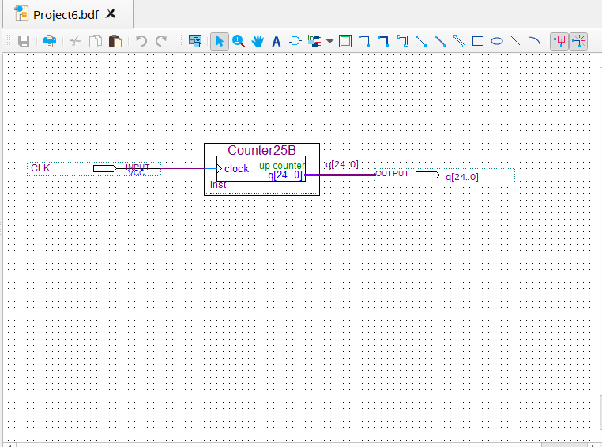
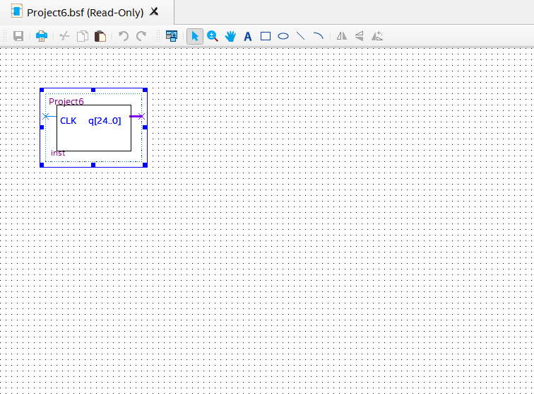
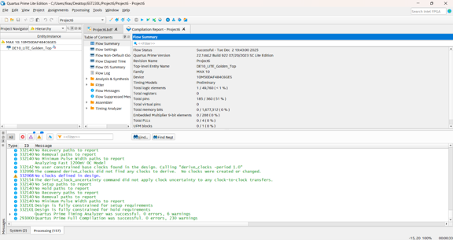
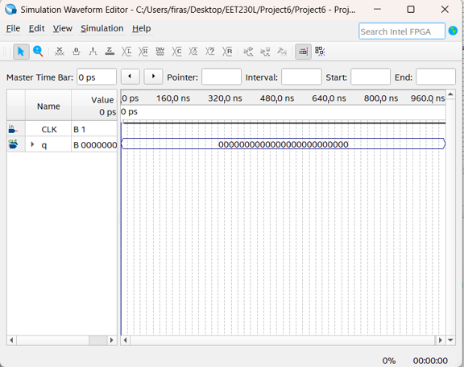
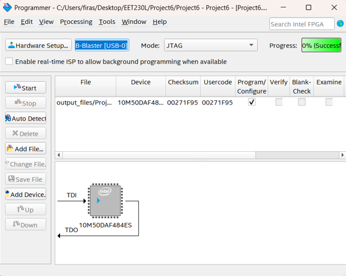

# Project 003 – FPGA 1.49 Hz Clock Divider

## Project Overview

This project demonstrates the development and FPGA implementation of a **1.49 Hz clock signal derived from a 50 MHz system clock** using **Intel Quartus Prime Lite** and the **Terasic DE10-Lite FPGA Development Board**.

A 25-bit binary up counter was created using the Quartus IP Catalog. The counter divides the 50 MHz system clock into progressively slower output frequencies.

The most significant counter output:

`q[24]`

produces a frequency of approximately:

**1.49 Hz**

The project demonstrates clock division, counter design, Quartus IP generation, bus-based digital design, FPGA pin assignments, compilation, programming, and physical hardware verification.

---

## Project Objectives

The objectives of this project were to:

- Create a low-frequency clock from the DE10-Lite 50 MHz system clock.
- Calculate the counter width required for approximately 1.49 Hz.
- Generate a 25-bit up counter using Quartus IP Catalog.
- Create a Quartus symbol for the generated counter.
- Integrate the counter into a top-level Block Diagram/Schematic.
- Work with a 25-bit output bus.
- Configure FPGA pin assignments.
- Use appropriate I/O standards.
- Compile the MAX 10 FPGA design.
- Program the DE10-Lite using USB-Blaster and JTAG.
- Observe different divided-clock frequencies on physical LEDs.
- Verify the frequency-divider behavior on hardware.

---

## Software and Hardware

### Software

- Intel Quartus Prime Lite
- Quartus IP Catalog
- Quartus Block Diagram/Schematic Editor
- Quartus Simulation Waveform Editor
- Quartus Pin Planner
- Quartus Programmer

### Hardware

- Terasic DE10-Lite FPGA Development Board
- Intel MAX 10 FPGA
- 50 MHz system clock
- On-board LEDs
- USB-Blaster programming interface
- JTAG programming mode

### Target FPGA Device

`10M50DAF484C6GES`

---

# Clock-Divider Theory

The objective is to derive a clock of approximately **1.49 Hz** from a **50 MHz** system clock.

A binary counter divides the input frequency by powers of two.

The project uses a 25-bit counter.

For the most significant bit:

**N = 25**

The division factor is:

**2^25 = 33,554,432**

Therefore:

**50,000,000 Hz / 33,554,432 ≈ 1.49 Hz**

The output:

`q[24]`

therefore changes at approximately 1.49 Hz.

---

# Frequency Relationship

The counter outputs divide the clock by progressively smaller powers of two.

The relevant outputs include:

| Counter Output | Approximate Relative Rate |
|---|---|
| `q[24]` | 1.49 Hz |
| `q[23]` | 2 × faster than `q[24]` |
| `q[22]` | 4 × faster than `q[24]` |
| `q[21]` | 8 × faster than `q[24]` |
| `q[20]` | 16 × faster than `q[24]` |

This makes a binary counter useful as a frequency divider.

---

# System Architecture

The fundamental design is:

```text
50 MHz System Clock
        |
        v
+------------------+
| 25-Bit Up Counter|
|    Counter25B    |
+---------+--------+
          |
          v
      q[24..0]
          |
          +---- q[24] → ~1.49 Hz
          +---- q[23] → 2× faster
          +---- q[22] → 4× faster
          +---- q[21] → 8× faster
          +---- q[20] → 16× faster
```

---

# Development Process

## Step 1 – Create the Quartus Project

A Quartus Prime Lite project named:

`Project6`

was created for the DE10-Lite FPGA.

The project configuration identifies:

```text
Project Revision: Project6
Top-Level Entity: Project6
FPGA Family: MAX 10
Target Device: 10M50DAF484C6GES
```

The principal project files are:

- `Project6.qpf`
- `Project6.qsf`

---

## Step 2 – Generate the 25-Bit Counter

Quartus IP Catalog was used to generate a counter using:

**Basic Functions → Arithmetic → LPM_COUNTER**

The counter was named:

`Counter25B`

The counter configuration included:

```text
Counter Width: 25 bits
Count Direction: Up only
Output Bus: q[24..0]
```

A 25-bit binary counter provides:

**2^25 = 33,554,432**

possible counter states.

---

## Step 3 – Create the Counter Symbol

A Quartus Block Symbol File was generated for the counter.

The resulting symbol is:

`Counter25B.bsf`

This allowed the generated IP counter to be used as a graphical component in the top-level Block Diagram/Schematic.

---

## Step 4 – Build the Top-Level Schematic

The top-level schematic is stored in:

`Project6.bdf`

The design connects:

- `CLK` to the counter clock input
- `q[24..0]` to the counter output bus

### Top-Level Design



The schematic demonstrates the use of a multi-bit Quartus bus to carry the 25 counter outputs.

---

## Step 5 – Create the Top-Level Symbol

A symbol was also generated from the completed `Project6` design.

The symbol provides:

```text
Input:
CLK

Output:
q[24..0]
```

### Project Symbol



---

# Compilation

## Step 6 – Compile the Design

The completed Quartus project was compiled for the Intel MAX 10 FPGA.

The project compilation completed successfully.

### Compilation Report



The compilation report confirms the design was processed for the selected MAX 10 FPGA.

The project configuration includes:

```text
Family: MAX 10
Device: 10M50DAF484C6GES
Top-Level Entity: Project6
```

---

# Functional Simulation Setup

## Step 7 – Create the Waveform

A Quartus waveform file was created:

`Waveform.vwf`

The simulation includes:

```text
CLK
q[24..0]
```

The output is represented as a 25-bit bus.

### Simulation Waveform



This waveform setup provides a software environment for observing the relationship between the system clock and counter output bus.

Because a full 1.49 Hz period is extremely long compared with nanosecond-scale simulation windows, physical FPGA testing is particularly useful for observing the lowest-frequency counter outputs.

---

# FPGA Pin Assignments

## Step 8 – Map Signals to the DE10-Lite

The project assignments stored in `Project6.qsf` map the clock and selected counter outputs to physical FPGA pins.

The principal assignments are:

| Signal | FPGA Pin | Purpose |
|---|---|---|
| `CLK` | `PIN_P11` | 50 MHz system clock input |
| `q[24]` | `PIN_A8` | Slowest displayed counter output |
| `q[23]` | `PIN_A9` | 2× faster output |
| `q[22]` | `PIN_A10` | 4× faster output |
| `q[21]` | `PIN_B10` | 8× faster output |
| `q[20]` | `PIN_D13` | 16× faster output |

The project configuration specifies:

```text
CLK: 3.3 V Schmitt Trigger
Counter Outputs: 3.3-V LVTTL
```

These assignments connect the digital frequency-divider design to physical DE10-Lite resources.

---

# FPGA Programming

## Step 9 – Connect the DE10-Lite

The DE10-Lite was connected to the computer through the USB-Blaster programming interface.

Quartus Programmer was configured using:

```text
Hardware: USB-Blaster
Mode: JTAG
FPGA Family: MAX 10
```

---

## Step 10 – Program the FPGA

The compiled design was loaded into Quartus Programmer and transferred to the physical FPGA.

### Quartus Programmer



This stage moved the frequency-divider design from Quartus into the physical DE10-Lite FPGA.

---

# Hardware Testing

## Step 11 – Observe the Counter Outputs

After FPGA programming, selected counter outputs were observed using the DE10-Lite LEDs.

The expected relative behavior is:

```text
q[24] → slowest selected output
q[23] → 2× faster
q[22] → 4× faster
q[21] → 8× faster
q[20] → 16× faster
```

The laboratory design uses the counter output frequencies to make the binary frequency-division behavior visible on physical hardware.

---

## 1.49 Hz Output

The most significant output:

`q[24]`

has an approximate frequency of:

**1.49 Hz**

This corresponds to approximately one cycle every:

**0.67 seconds**

The slower output provides a human-observable clock signal derived entirely from the original 50 MHz FPGA system clock.

---

# Hardware Demonstration

The physical DE10-Lite demonstration is located in the `Hardware` folder.

[View DE10-Lite 1.49 Hz Clock Demo](Hardware/DE10-Lite-1.49Hz-Clock-Demo.mp4)

The video documents the counter outputs operating on the physical FPGA board.

---

# Complete FPGA Development Workflow

```text
50 MHz Clock Requirement
        |
        v
Determine Counter Width
        |
        v
N = 25
        |
        v
Generate Counter25B
using Quartus IP Catalog
        |
        v
Create Counter Symbol
        |
        v
Build Project6.bdf
        |
        v
Create q[24..0] Bus
        |
        v
Compile the Design
        |
        v
Configure FPGA Pins
        |
        v
USB-Blaster / JTAG
        |
        v
Program MAX 10 FPGA
        |
        v
Observe LED Frequencies
        |
        v
Verify ~1.49 Hz Output
```

---

# Project Results

The project demonstrates the implementation of an FPGA-based frequency divider using a 25-bit binary up counter.

The completed design demonstrates:

- 50 MHz FPGA clock input
- 25-bit counter generation
- Quartus IP Catalog
- Binary frequency division
- 25-bit output bus
- Approximately 1.49 Hz output from `q[24]`
- Quartus schematic integration
- FPGA device configuration
- Physical pin assignments
- Successful compilation
- USB-Blaster/JTAG programming
- DE10-Lite hardware implementation
- Multiple observable divided-clock frequencies

---

# Project Files

## Quartus Source Files

The Quartus source files are located in:

[Quartus Source Files](Quartus/)

Primary files include:

| File | Purpose |
|---|---|
| `Project6.qpf` | Quartus project file |
| `Project6.qsf` | Device configuration and pin assignments |
| `Project6.bdf` | Top-level clock-divider schematic |
| `Project6.bsf` | Generated symbol for Project6 |
| `Counter25B.bsf` | Generated symbol for the 25-bit counter |
| `Waveform.vwf` | Simulation waveform |
| `DE10_LITE_Golden_Top.v` | DE10-Lite reference/top-level Verilog file |

If available, the generated Quartus IP integration file should also be preserved:

`Counter25B.qip`

---

## Project Screenshots

Design, compilation, simulation, and programming screenshots are located in:

[Project Screenshots](Screenshots/)

---

## Hardware Demonstration

The physical FPGA demonstration is located in:

[Hardware Demonstration](Hardware/)

Direct video:

[Watch DE10-Lite 1.49 Hz Clock Demo](Hardware/DE10-Lite-1.49Hz-Clock-Demo.mp4)

---

# Skills Demonstrated

## FPGA and Digital Logic

- FPGA Development
- Digital Frequency Division
- Binary Counters
- Clock Division
- Sequential Logic
- Multi-Bit Buses
- FPGA I/O
- Digital Timing Concepts

## Quartus Prime Lite

- Quartus Project Development
- IP Catalog
- LPM_COUNTER
- Block Diagram/Schematic Editor
- Symbol Generation
- Simulation Waveform Editor
- FPGA Device Configuration
- Pin Assignment
- Compilation
- Quartus Programmer

## FPGA Hardware

- Terasic DE10-Lite
- Intel MAX 10 FPGA
- 50 MHz System Clock
- LED Outputs
- USB-Blaster
- JTAG Programming
- Physical Hardware Testing

## Engineering

- Frequency Analysis
- Digital-System Design
- Mathematical Analysis
- Simulation
- Testing and Validation
- Hardware/Software Integration
- Troubleshooting
- Technical Documentation

---

# What I Learned

This project strengthened my understanding of how binary counters can be used as digital frequency dividers.

I gained practical experience calculating the required counter width for a target output frequency, generating parameterized IP using the Quartus IP Catalog, creating and connecting multi-bit buses, configuring FPGA pins, compiling a digital design, and programming the DE10-Lite board.

The project also demonstrated how extremely high-frequency FPGA clocks can be divided into much slower human-observable signals using sequential digital logic.

Observing multiple counter outputs on the physical FPGA board reinforced the relationship between binary counter stages and frequency division.

---

# Conclusion

Project 003 demonstrates the creation of an approximately **1.49 Hz clock from a 50 MHz FPGA system clock** using a 25-bit binary up counter.

The project progressed through frequency calculation, Quartus IP generation, schematic integration, compilation, FPGA pin configuration, JTAG programming, and physical DE10-Lite verification.

This project provides practical evidence of experience with **clock division, binary counters, Quartus IP Catalog, sequential logic, FPGA configuration, digital timing, and physical FPGA implementation**.
