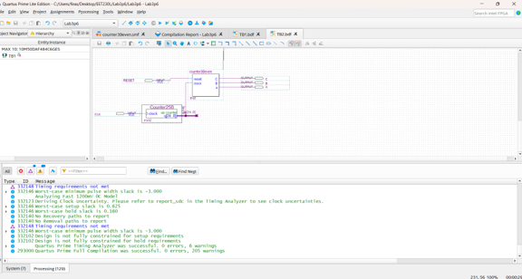
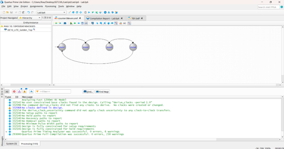
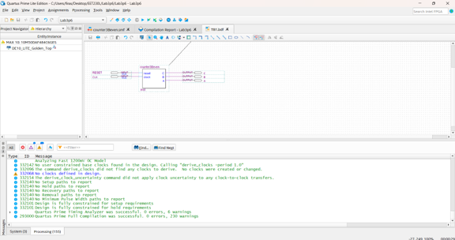
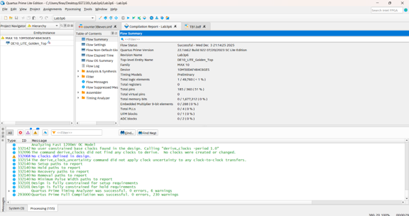
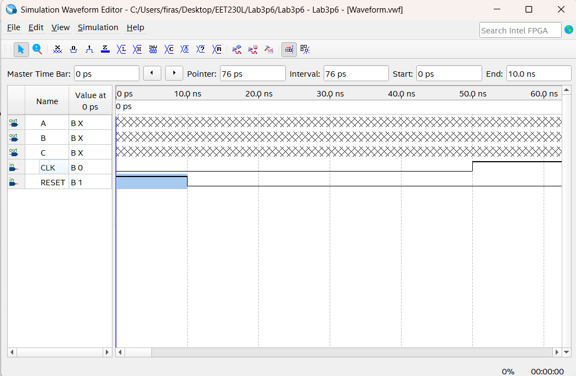
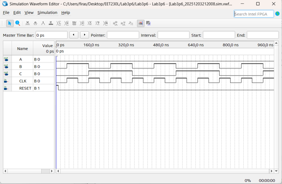
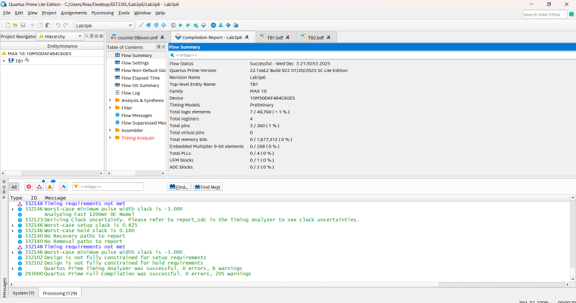
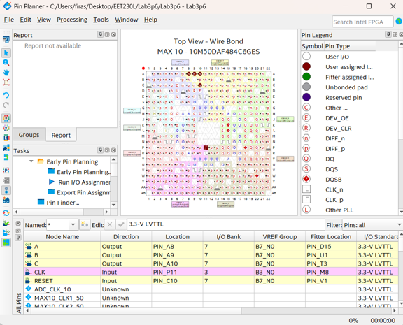
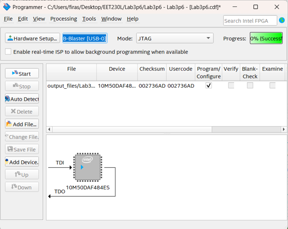

# Project 004 – Moore State Machine Development Screenshots

## Overview

This folder contains ten screenshots documenting the development, simulation, integration, compilation, FPGA configuration, and programming stages of **Project 004 – Moore State Machine Even Counter**.

The screenshots demonstrate the complete Quartus Prime Lite workflow from state-machine design through physical FPGA programming.

---

# Screenshot 1 – Final TB2 Hardware Schematic

## File

[`Picture1.png`](Picture1.png)

## Screenshot



## Description

This screenshot shows the final top-level hardware schematic.

The design integrates:

- `Counter25B`
- `counter3Beven`
- `CLK`
- `RESET`
- `A`
- `B`
- `C`

The 25-bit counter reduces the 50 MHz system clock before applying the slower clock to the Moore state machine.

This allows the state transitions to be observed visually on the physical DE10-Lite board.

---

# Screenshot 2 – Moore State Diagram

## File

[`Picture2.png`](Picture2.png)

## Screenshot



## Description

This screenshot shows the four-state Moore state-machine diagram created in the Quartus State Machine Editor.

The states transition continuously in a loop:

```text
State 1
   |
   v
State 2
   |
   v
State 3
   |
   v
State 4
   |
   +------> State 1
```

Each state produces a fixed output value.

The complete sequence is:

```text
000 → 010 → 100 → 110 → 000
```

---

# Screenshot 3 – TB1 Simulation Schematic

## File

[`Picture3.png`](Picture3.png)

## Screenshot



## Description

This screenshot shows `TB1.bdf`.

TB1 contains the generated `counter3Beven` block connected to:

```text
Inputs:
RESET
CLK

Outputs:
A
B
C
```

This schematic was used to test the state machine independently before the slower hardware clock was integrated.

---

# Screenshot 4 – TB1 Compilation Report

## File

[`Picture4.png`](Picture4.png)

## Screenshot



## Description

This screenshot shows the Quartus compilation Flow Summary for the state-machine test configuration.

Compiling TB1 verifies that the generated state-machine logic and schematic are valid before simulation.

---

# Screenshot 5 – Initial Waveform Configuration

## File

[`Picture5.png`](Picture5.png)

## Screenshot



## Description

This screenshot shows the Simulation Waveform Editor before the final simulation is run.

The waveform contains:

```text
A
B
C
CLK
RESET
```

The RESET signal is forced HIGH briefly at the start of the simulation.

The clock is configured for repetitive transitions.

---

# Screenshot 6 – State Machine Simulation

## File

[`Picture6.png`](Picture6.png)

## Screenshot



## Description

This screenshot shows the completed functional simulation.

The outputs:

```text
A
B
C
```

change according to the four-state Moore machine.

Reading the outputs as:

```text
CBA
```

produces the expected sequence:

```text
000
010
100
110
000
...
```

This verifies the state-machine logic before hardware implementation.

---

# Screenshot 7 – Final TB2 Compilation

## File

[`Picture7.png`](Picture7.png)

## Screenshot


## Description

This screenshot shows the final integrated TB2 design after compilation.

TB2 combines:

- Clock divider
- Moore state machine
- RESET control
- State outputs

This stage verifies the complete hardware architecture before programming the FPGA.

---

# Screenshot 8 – Final Flow Summary

## File

[`Picture8.png`](Picture8.png)

## Screenshot



## Description

This screenshot shows the Quartus Flow Summary for the final TB2 implementation.

The design targets:

```text
FPGA Family: MAX 10
Device: 10M50DAF484C6GES
Top-Level Entity: TB2
```

This confirms that the integrated design was processed for the intended DE10-Lite FPGA.

---

# Screenshot 9 – FPGA Pin Planner

## File

[`Picture9.png`](Picture9.png)

## Screenshot



## Description

This screenshot shows Quartus Pin Planner with the primary Moore state-machine signals mapped to physical FPGA pins.

The assignments include:

| Signal | FPGA Pin |
|---|---|
| `A` | `PIN_A8` |
| `B` | `PIN_A9` |
| `C` | `PIN_A10` |
| `CLK` | `PIN_P11` |
| `RESET` | `PIN_C10` |

This stage connects the logical FPGA design to the physical DE10-Lite board.

---

# Screenshot 10 – Quartus Programmer

## File

[`Picture10.png`](Picture10.png)

## Screenshot



## Description

This screenshot shows Quartus Programmer after loading the compiled design for the DE10-Lite.

The configuration uses:

```text
Hardware: USB-Blaster
Mode: JTAG
Target: Intel MAX 10 FPGA
```

The screenshot shows a successful FPGA programming operation.

This represents the transition from software design to physical hardware implementation.

---

# Screenshot Summary

| Screenshot | Development Stage |
|---|---|
| `Picture1.png` | Final TB2 hardware schematic |
| `Picture2.png` | Moore state diagram |
| `Picture3.png` | TB1 simulation schematic |
| `Picture4.png` | TB1 compilation report |
| `Picture5.png` | Initial waveform setup |
| `Picture6.png` | Functional FSM simulation |
| `Picture7.png` | Final TB2 compilation |
| `Picture8.png` | Final FPGA Flow Summary |
| `Picture9.png` | DE10-Lite pin assignments |
| `Picture10.png` | USB-Blaster/JTAG programming |

---

# Complete Visual Development Sequence

```text
Moore State Diagram
        |
        v
Generate Verilog
        |
        v
TB1 Schematic
        |
        v
Compile TB1
        |
        v
Waveform Setup
        |
        v
Functional Simulation
        |
        v
Integrate Counter25B
        |
        v
TB2 Hardware Design
        |
        v
Final Compilation
        |
        v
FPGA Pin Assignment
        |
        v
Quartus Programmer
        |
        v
DE10-Lite Hardware
```

---

# Related Project Sections

Return to the main project:

[Project 004 Main README](../README.md)

View the Quartus source files:

[Quartus Source Files](../Quartus/)

View the physical FPGA demonstration:

[Hardware Demonstration](../Hardware/)

---

# Purpose of This Folder

This folder provides visual evidence of the complete Moore state-machine FPGA development process.

Together with the source files and hardware demonstration, the screenshots document state-machine design, Verilog generation, simulation, hierarchical FPGA integration, pin configuration, compilation, programming, and physical implementation.
