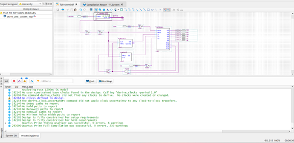
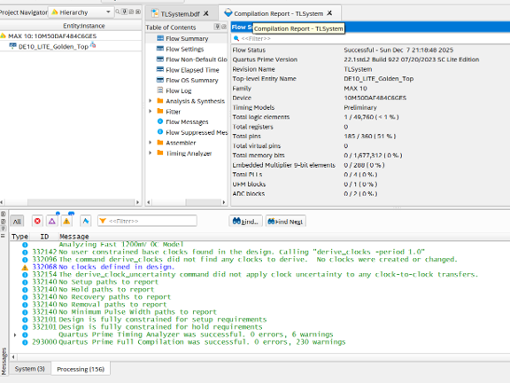
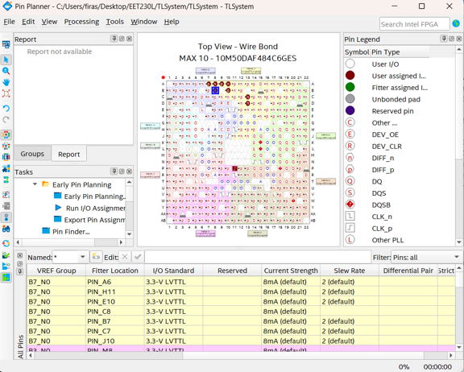
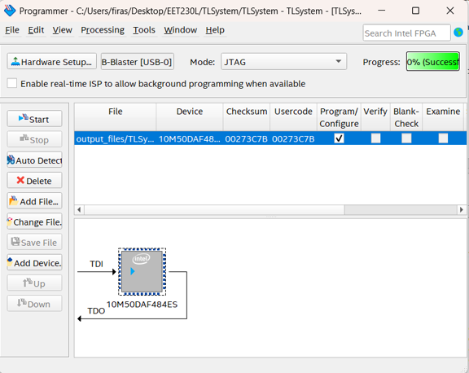

# Project 005 – Development Screenshots

## Overview

This folder contains the Quartus Prime Lite screenshots documenting the development and implementation of **Project 005 – FPGA Traffic Light Control System**.

The screenshots provide visual evidence of the traffic-light system design, FPGA configuration, compilation, and hardware-programming workflow.

---

# Screenshot Files

```text
Picture1.png
Picture2.png
Picture3.png
Picture4.png
```

---

# Screenshot 1

## File

```text
Picture1.png
```



This screenshot documents the Quartus traffic-light system development process.

It forms part of the visual engineering record showing how the traffic-light controller was implemented and prepared for FPGA operation.

---

# Screenshot 2

## File

```text
Picture2.png
```



This screenshot provides additional evidence of the Quartus implementation and verification process for the traffic-light control system.

---

# Screenshot 3

## File

```text
Picture3.png
```



This screenshot documents another stage of the FPGA implementation workflow.

The complete project integrates:

```text
TrafficLights
Counter25B
oneshot8
oneshot22
```

into the final traffic-light controller.

---

# Screenshot 4

## File

```text
Picture4.png
```



This screenshot provides visual evidence from the final stages of the Quartus/DE10-Lite development process.

---

# System Being Documented

The screenshots correspond to a traffic-light controller with:

```text
Main Street:
MR
MY
MG

Side Street:
SR
SY
SG
```

and inputs:

```text
VS
reset
sysclock
```

---

# Timing Architecture

The traffic-light system uses:

```text
50 MHz System Clock
        |
        v
   Counter25B
        |
        v
     ~1.49 Hz
        |
   +----+----+
   |         |
   v         v
oneshot8  oneshot22
~5.37 s   ~14.77 s
   |         |
   +----+----+
        |
        v
 TrafficLights FSM
```

---

# Project Source Files

The screenshots support the source files located in:

```text
../Quartus/
```

including:

```text
TrafficLights.vhd
Counter25B.vhd
count5B.vhd
oneshot22.bdf
oneshot8.bdf
TLSystem.bdf
```

---

# Hardware Demonstration

The completed system is demonstrated on the physical DE10-Lite FPGA in:

```text
../Hardware/DE10-Lite-Traffic-Light-System-Demo.mov
```

---

# Related Documentation

Main project:

```text
../README.md
```

Quartus source:

```text
../Quartus/README.md
```

Hardware demonstration:

```text
../Hardware/README.md
```

---

# Purpose

These screenshots provide visual documentation supporting the FPGA source files and physical hardware demonstration.

Together, the repository documents the progression from reusable digital modules to an integrated FPGA traffic-light control system.
