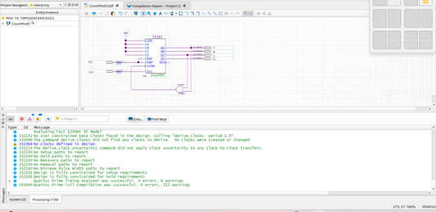
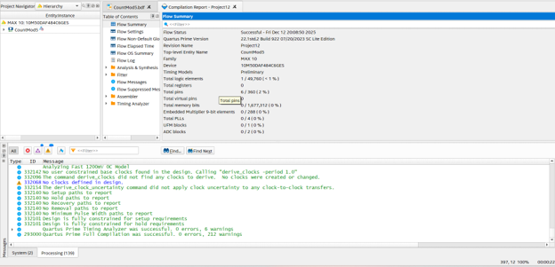
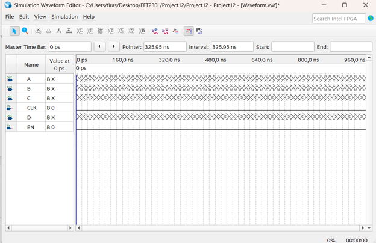
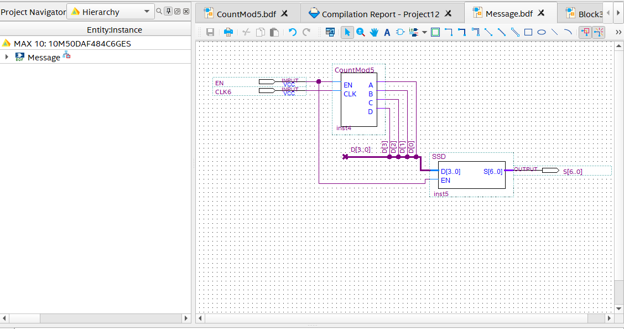
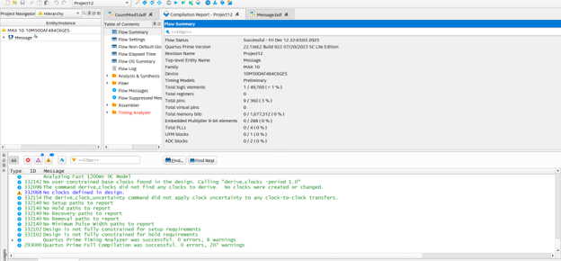
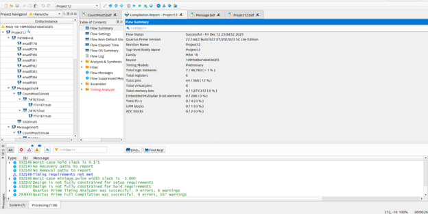
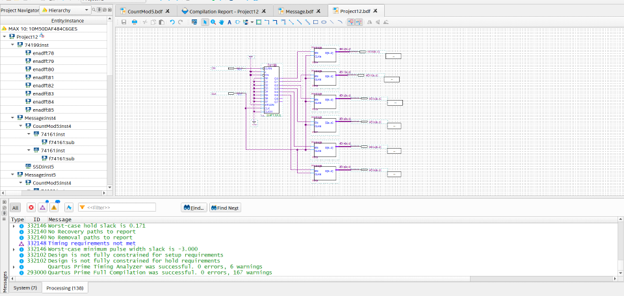
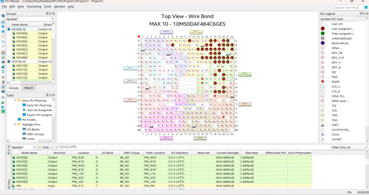
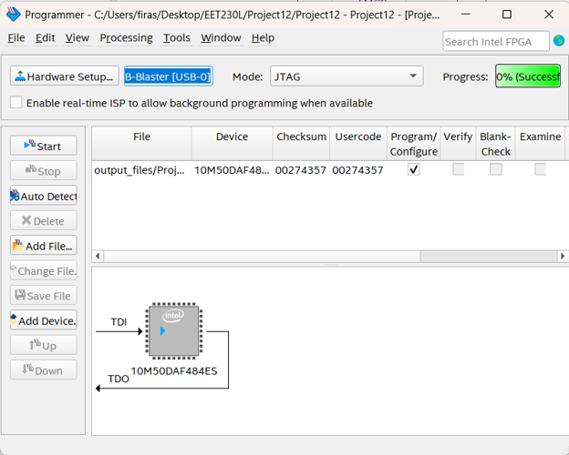

# Project 006 – FPGA Scrolling Message on Six 7-Segment Displays

## Project Overview

This project demonstrates the design, simulation, compilation, FPGA programming, and physical implementation of a **scrolling alphanumeric message system** using **Intel Quartus Prime Lite** and the **Terasic DE10-Lite FPGA Development Board**.

The system scrolls a five-character message across all six on-board 7-segment displays.

The project combines several digital-design concepts:

- Mod-5 counting
- 7-segment display encoding
- VHDL reuse
- Hierarchical schematic design
- Shift-register operation
- Parallel display movement
- Enable control
- Manual clocking
- FPGA pin assignment
- Physical DE10-Lite implementation

The project uses a `74199` shift register in the top-level design to move the message from the far-right 7-segment display toward the far-left display.

---

## Project Objectives

The objectives of this project were to:

- Create a message that scrolls across all six DE10-Lite 7-segment displays.
- Develop a Mod-5 counter.
- Verify the Mod-5 counter through simulation.
- Reuse a previously developed 7-segment display driver.
- Build a message-generation module.
- Verify message-generation behavior.
- Create reusable Quartus block symbols.
- Use a 74199 shift register to move display data.
- Create a hierarchical top-level FPGA design.
- Assign all six 7-segment display outputs.
- Configure an enable input.
- Configure a manual clock input.
- Compile and program the MAX 10 FPGA.
- Verify scrolling behavior on physical hardware.

---

# Software and Hardware

## Software

- Intel Quartus Prime Lite
- VHDL
- Quartus Block Diagram/Schematic Editor
- Quartus Simulation Waveform Editor
- Quartus Pin Planner
- Quartus Programmer

## Hardware

- Terasic DE10-Lite FPGA Development Board
- Intel MAX 10 FPGA
- Six on-board 7-segment displays
- KEY0 pushbutton
- SW4 switch
- USB-Blaster
- JTAG

## Target FPGA

```text
10M50DAF484C6GES
```

---

# System Architecture

The scrolling-message system is constructed hierarchically.

```text
        +----------------+
        |   CountMod5    |
        |  Mod-5 Counter |
        +-------+--------+
                |
                v
           Count Value
                |
                v
        +----------------+
        |    Message     |
        | Character Data |
        +-------+--------+
                |
                v
        +----------------+
        |      SSD       |
        | 7-Segment Code |
        +-------+--------+
                |
                v
        +----------------+
        | 74199 Shift    |
        |   Register     |
        +-------+--------+
                |
                v
      HEX0 HEX1 HEX2 HEX3 HEX4 HEX5
```

---

# Mod-5 Counter

## Purpose

The scrolling message contains five alphanumeric characters.

Because there are five characters, the system requires a counter that cycles through:

```text
0
1
2
3
4
0
1
2
...
```

The counter is implemented in:

```text
CountMod5.bdf
```

---

# CountMod5 Design

The Mod-5 counter uses a `74161` counter and supporting logic.

The design accepts:

```text
EN
CLK
```

and produces:

```text
A
B
C
D
```

The counter is configured so that it resets after reaching decimal 4.

This produces the repeating sequence:

```text
0000
0001
0010
0011
0100
0000
...
```

---

# CountMod5 Compilation

The counter was first developed and compiled independently.

### CountMod5 Schematic



The Quartus compilation completed successfully.

### Compilation Summary



This stage verifies the counter subsystem before it is integrated into the message logic.

---

# Mod-5 Functional Simulation

A Quartus waveform was created to verify that `CountMod5` repeatedly counts from 0 through 4.

The waveform includes:

```text
A
B
C
D
CLK
EN
```

### Waveform Setup



The counter simulation confirms that the module can provide the five repeating selection states required for the message characters.

---

# Message Module

## Purpose

The next stage of the design creates the correct 7-segment character data for each Mod-5 counter state.

The message subsystem is implemented in:

```text
Message.bdf
```

The module combines:

- `CountMod5`
- `SSD`
- Enable logic
- 7-segment output generation

---

# Reusing SSD.vhd

The project reuses the 7-segment display driver developed in an earlier FPGA project.

The source file is:

```text
SSD.vhd
```

This module receives a digital character/value code and generates the corresponding:

```text
S[6..0]
```

7-segment output.

Reusing this source demonstrates modular FPGA design instead of rebuilding the display decoder from scratch.

---

# Message Schematic

The `Message.bdf` design connects the Mod-5 counter to the SSD display driver.

### Message Design



The signal flow is:

```text
EN + CLK
   |
   v
CountMod5
   |
   v
D[3..0]
   |
   v
SSD
   |
   v
S[6..0]
```

The counter determines which character is selected, and the SSD module converts that selection into a 7-segment display pattern.

---

# Message Module Compilation

The `Message` module was compiled independently before integration into the final system.

### Message Compilation



The successful compile confirms that the counter and display-driver modules are correctly connected.

---

# Enable Control

The `Message` function includes an enable signal.

During simulation, the enable signal is initially inactive.

After a brief one-clock-cycle delay:

```text
EN = HIGH
```

The message output becomes active.

This verifies that the display logic remains disabled until explicitly enabled.

---

# Top-Level Project12 Design

The final system is implemented in:

```text
Project12.bdf
```

The top-level Quartus entity is:

```text
Project12
```

The top-level design combines:

- Message-generation logic
- Shift-register logic
- Six 7-segment display outputs
- Manual clock control
- Project enable control

---

# 74199 Shift Register

A `74199` shift register is used to create the scrolling behavior.

The shift register moves the generated message data through the display chain.

Conceptually:

```text
New Character
     |
     v
+----------+
|  74199   |
|  Shift   |
| Register |
+----+-----+
     |
     v
HEX0 → HEX1 → HEX2 → HEX3 → HEX4 → HEX5
```

With each manual clock event, the displayed data moves one position toward the left.

---

# Scrolling Direction

The project is designed so the message begins on the far-right display and moves toward the far-left display.

Conceptually:

```text
Step 1:
_ _ _ _ _ A

Step 2:
_ _ _ _ A B

Step 3:
_ _ _ A B C

Step 4:
_ _ A B C D

Step 5:
_ A B C D E

Step 6:
A B C D E _
```

The exact symbols depend on the five-character message encoded in the project.

---

# Six 7-Segment Displays

The final FPGA design drives:

```text
HEX0
HEX1
HEX2
HEX3
HEX4
HEX5
```

Each display uses seven segment-control outputs.

Therefore, the top-level design controls:

```text
6 × 7 = 42
```

individual segment signals.

---

# Project12 Compilation

After integrating all required modules, `Project12` was set as the final top-level entity and compiled.

### Top-Level Compilation



The project successfully targets the Intel MAX 10 FPGA.

---

# Top-Level Hierarchical Design

The final Quartus hierarchy contains multiple instances of the message/display logic and shift-register circuitry.

### Final Schematic



The final design distributes the scrolling data across all six 7-segment displays.

---

# FPGA Pin Assignment

Quartus Pin Planner was used to map the six display buses to the physical DE10-Lite 7-segment pins.

### Pin Planner



The design contains physical assignments for:

```text
HEX0[6..0]
HEX1[6..0]
HEX2[6..0]
HEX3[6..0]
HEX4[6..0]
HEX5[6..0]
```

The project uses:

```text
3.3-V LVTTL
```

for the display I/O.

---

# Manual Clock Input

The hardware project uses:

```text
KEY0
```

to manually clock the scrolling message.

The corresponding FPGA assignment is:

```text
CLK → PIN_B8
```

The clock input is configured using:

```text
3.3 V Schmitt Trigger
```

Each button activation advances the scrolling message.

---

# Enable Input

The project is enabled using:

```text
SW4
```

The top-level signal is:

```text
ON
```

The FPGA assignment is:

```text
ON → PIN_A12
```

Setting SW4 HIGH enables the scrolling-message circuit.

---

# Hardware Operation

The physical operation follows this process:

```text
Set SW4 HIGH
      |
      v
Enable Project
      |
      v
Press KEY0
      |
      v
Generate Clock Event
      |
      v
Advance Message
      |
      v
Shift Display Data
      |
      v
Update HEX0–HEX5
```

Each clock event advances the message by one display position.

---

# Quartus Programmer

After compilation, the design was transferred to the DE10-Lite through Quartus Programmer.

### FPGA Programming



Programming configuration:

```text
Hardware: USB-Blaster
Mode: JTAG
Target: Intel MAX 10 FPGA
```

---

# Hardware Demonstration

The completed scrolling-message system is demonstrated in:

`Hardware/DE10-Lite-Scrolling-Message-Demo.mp4`

[View DE10-Lite Scrolling Message Demo](Hardware/DE10-Lite-Scrolling-Message-Demo.mp4)

The video provides physical evidence that the message scrolls across the six DE10-Lite 7-segment displays.

---

# Complete Development Workflow

```text
Define Five-Character Message
          |
          v
Create CountMod5.bdf
          |
          v
Compile Counter
          |
          v
Simulate 0–4 Sequence
          |
          v
Reuse SSD.vhd
          |
          v
Create Message.bdf
          |
          v
Verify Enable Logic
          |
          v
Generate Message Symbol
          |
          v
Create Project12.bdf
          |
          v
Integrate 74199 Shift Register
          |
          v
Connect Six HEX Displays
          |
          v
Assign FPGA Pins
          |
          v
Compile Final Project
          |
          v
USB-Blaster / JTAG
          |
          v
Program DE10-Lite
          |
          v
Enable with SW4
          |
          v
Clock with KEY0
          |
          v
Observe Scrolling Message
```

---

# Project Files

## Quartus Files

The Quartus source files are located in:

[Quartus Source Files](Quartus/)

Important files include:

| File | Purpose |
|---|---|
| `Project12.qpf` | Quartus project file |
| `Project12.qsf` | FPGA settings and pin assignments |
| `Project12.bdf` | Final scrolling-message schematic |
| `Message.bdf` | Message-generation module |
| `Message.bsf` | Generated message symbol |
| `CountMod5.bdf` | Mod-5 counter |
| `SSD.vhd` | Reused 7-segment display driver |
| `Waveform.vwf` | Mod-5 simulation waveform |
| `Waveform2.vwf` | Message simulation waveform |
| `DE10_LITE_Golden_Top.v` | DE10-Lite reference source |

---

# Screenshots

Development screenshots are located in:

[Project Screenshots](Screenshots/)

---

# Hardware

The DE10-Lite hardware demonstration is located in:

[Hardware Demonstration](Hardware/)

---

# Skills Demonstrated

## FPGA Development

- Intel MAX 10 FPGA
- Terasic DE10-Lite
- FPGA Programming
- Hierarchical FPGA Design
- Digital I/O
- Hardware Verification

## Digital Logic

- Counters
- Modulo Counters
- Shift Registers
- 74161 Counter
- 74199 Shift Register
- Enable Logic
- Clocked Sequential Logic

## VHDL

- Reusable HDL Modules
- 7-Segment Display Drivers
- Hierarchical HDL Integration

## Quartus Prime Lite

- Block Diagram/Schematic Editor
- VHDL Integration
- Simulation Waveform Editor
- Symbol Generation
- Pin Planner
- Compilation
- Quartus Programmer

## Display Systems

- 7-Segment Display Encoding
- Six-Display Control
- Scrolling Display Logic
- Character Sequencing

## Engineering

- Modular Design
- Sequential-System Design
- Simulation
- Troubleshooting
- Testing and Validation
- Hardware/Software Integration
- Technical Documentation

---

# What I Learned

This project strengthened my understanding of how several digital modules can be combined to create a more complex FPGA display system.

I gained practical experience developing a Mod-5 counter, reusing a VHDL 7-segment display driver, creating hierarchical symbols, and integrating a shift register to move display data across multiple output devices.

The project also demonstrated how sequential logic and manual clocking can control the timing and position of displayed information.

Driving all six DE10-Lite 7-segment displays required careful FPGA pin assignment and reinforced the importance of matching logical HDL signals to physical board resources.

Most importantly, the project demonstrated how reusable components from earlier designs can be integrated into a larger FPGA system rather than recreated from the beginning.

---

# Conclusion

Project 006 demonstrates a complete FPGA scrolling-message system implemented using Intel Quartus Prime Lite and the Terasic DE10-Lite board.

The project combines a Mod-5 counter, reusable VHDL display driver, hierarchical message-generation logic, and a 74199 shift register to move a five-character message across six physical 7-segment displays.

The completed project provides practical evidence of experience with **sequential logic, counters, shift registers, VHDL reuse, hierarchical FPGA design, multi-display control, pin assignment, JTAG programming, and physical FPGA verification**.
