# Project 007 – FPGA LFSR Random Scrolling Display

## Project Overview

This project demonstrates the design, simulation, integration, and physical FPGA implementation of a **pseudo-random hexadecimal scrolling display system** using **Intel Quartus Prime Lite** and the **Terasic DE10-Lite FPGA Development Board**.

The system continuously generates a pseudo-random 4-bit value using a **Linear Feedback Shift Register (LFSR)** and displays hexadecimal values using a custom **VHDL 7-segment display driver**.

A **Johnson counter** is incorporated into the final system to sequentially control the display positions, while an FPGA clock-divider circuit derives a slower clock from the DE10-Lite's onboard system clock.

The complete project combines:

- Linear Feedback Shift Register design
- Pseudo-random number generation
- XOR feedback logic
- Shift registers
- VHDL
- Hexadecimal 7-segment decoding
- Johnson counters
- Sequential display control
- Hierarchical FPGA design
- Clock division
- Functional simulation
- FPGA pin assignment
- Quartus compilation
- USB-Blaster/JTAG programming
- Physical DE10-Lite testing

---

# Project Objective

The objective of this project is to create a system that continuously displays and scrolls pseudo-random hexadecimal data across the DE10-Lite 7-segment displays.

The design progresses through several independently developed and verified subsystems:

1. LFSR pseudo-random number generator
2. Hexadecimal 7-segment display driver
3. Combined LFSR/display module
4. Johnson counter
5. Final integrated scrolling-display system

This modular approach allows each subsystem to be tested before being incorporated into the final FPGA implementation.

---

# Software and Hardware

## Software

- Intel Quartus Prime Lite
- VHDL
- Quartus Block Diagram/Schematic Editor
- Quartus Simulation Waveform Editor
- Quartus Pin Planner
- Quartus Programmer

## Hardware

- Terasic DE10-Lite FPGA Development Board
- Intel MAX 10 FPGA
- On-board system clock
- Four 7-segment displays used by the scrolling system
- SW4 enable control
- USB-Blaster programming interface
- JTAG programming

## Target FPGA

```text
10M50DAF484C6GES
```

---

# System Architecture

The completed system combines several digital modules.

```text
                FPGA Clock
                    |
                    v
             +-------------+
             | Clock       |
             | Divider     |
             +------+------+
                    |
                    v
              Slow Clock
                    |
        +-----------+-----------+
        |                       |
        v                       v
+---------------+       +---------------+
|     LFSR      |       |    Johnson    |
| Random Data   |       | Display       |
| Generator     |       | Sequencer     |
+-------+-------+       +-------+-------+
        |                       |
        v                       |
    D[3..0]                     |
        |                       |
        v                       |
+---------------+               |
| Display.vhd   |               |
| Hex Decoder   |               |
+-------+-------+               |
        |                       |
        v                       v
     S[6..0]            Display Enable
        |                       |
        +-----------+-----------+
                    |
                    v
          DE10-Lite HEX Displays
```

---

# Part 1 – Linear Feedback Shift Register

## Purpose

A Linear Feedback Shift Register is used to generate a repeating pseudo-random binary sequence.

Unlike a normal binary counter, the LFSR does not simply count upward.

Instead, selected register outputs are combined through XOR feedback and returned to the input of the first stage.

This creates a deterministic sequence that appears pseudo-random.

---

# LFSR Design

The primary LFSR schematic is:

```text
LFSR.bdf
```

The design uses multiple flip-flop stages and feedback logic.

The primary inputs are:

```text
CLK
EN
```

The generated output bits are represented by four binary outputs.

These outputs form a 4-bit value that can be interpreted as an unsigned decimal or hexadecimal value.

---

# LFSR Feedback Concept

The fundamental LFSR architecture can be represented as:

```text
        +-----+    +-----+    +-----+    +-----+
CLK --->| FF0 |--->| FF1 |--->| FF2 |--->| FF3 |
        +--+--+    +-----+    +-----+    +--+--+
           ^                               |
           |                               |
           +---------- XOR Feedback -------+
```

The XOR feedback prevents the circuit from behaving like a conventional binary counter.

---

# LFSR Schematic

The complete LFSR was constructed using Quartus Block Diagram/Schematic Editor.

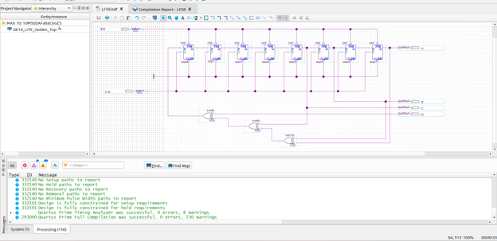

The design was compiled before functional simulation.

---

# LFSR Compilation

Quartus compilation was used to verify:

- Flip-flop connectivity
- XOR feedback logic
- Clock routing
- Enable logic
- FPGA compatibility

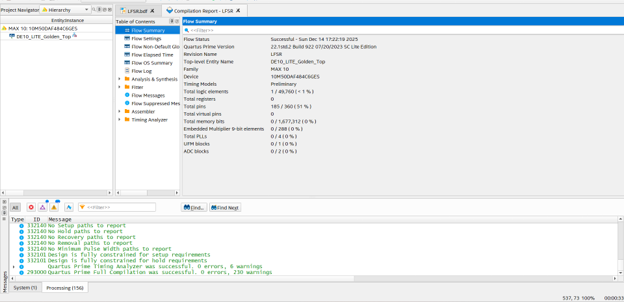

The completed project compiled successfully for the Intel MAX 10 FPGA.

---

# LFSR Functional Simulation

A waveform was created to verify the pseudo-random sequence.

The simulation uses:

```text
CLK
EN
```

and the four LFSR outputs.

During simulation:

```text
EN = HIGH
```

so the LFSR advances with each clock event.

The output bits were grouped into one unsigned value to make the sequence easier to analyze.

---

# Pseudo-Random Output Sequence

The waveform demonstrates a non-linear repeating sequence rather than a simple binary count.

An example sequence observed during simulation includes values such as:

```text
15
14
12
8
1
2
5
3
15
7
14
12
8
9
3
6
5
...
```

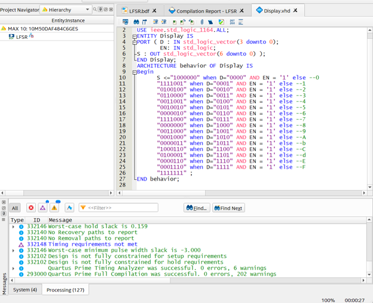

This verifies the pseudo-random behavior of the feedback shift register.

---

# Part 2 – Hexadecimal 7-Segment Display Driver

## Purpose

The original 7-segment display-driver concept was expanded so that all sixteen 4-bit values could be displayed.

The supported values are:

```text
0
1
2
3
4
5
6
7
8
9
A
b
C
d
E
F
```

The display driver is implemented in:

```text
Display.vhd
```

---

# Display VHDL Interface

The VHDL entity uses:

```vhdl
D  : IN std_logic_vector(3 downto 0);
EN : IN std_logic;
S  : OUT std_logic_vector(6 downto 0);
```

where:

```text
D[3..0] = hexadecimal input
EN      = display enable
S[6..0] = seven segment-control outputs
```

---

# Hexadecimal Display Mapping

The VHDL design maps all sixteen possible 4-bit input combinations.

```text
0000 → 0
0001 → 1
0010 → 2
0011 → 3
0100 → 4
0101 → 5
0110 → 6
0111 → 7
1000 → 8
1001 → 9
1010 → A
1011 → b
1100 → C
1101 → d
1110 → E
1111 → F
```

When the display is disabled, all display segments are turned off.

---

# Display VHDL Source

The hexadecimal decoder was implemented directly in VHDL.

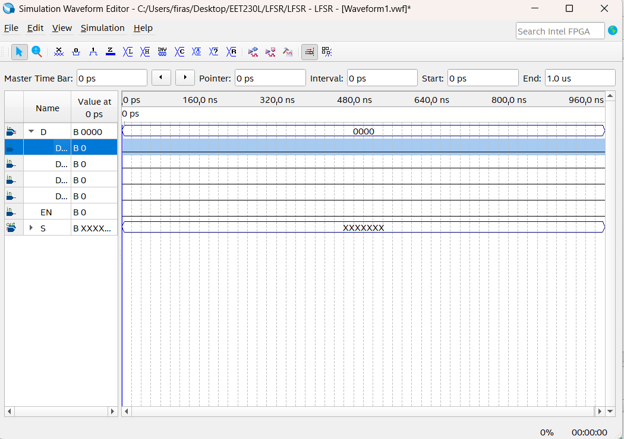

This demonstrates HDL-based combinational logic design rather than relying entirely on schematic components.

---

# Display Simulation

A waveform was created to verify all hexadecimal combinations.

The simulation includes:

```text
D[3..0]
EN
S[6..0]
```

The four input bits were assigned different timing periods so the simulation automatically progresses through all hexadecimal input values.

### Initial Waveform Setup

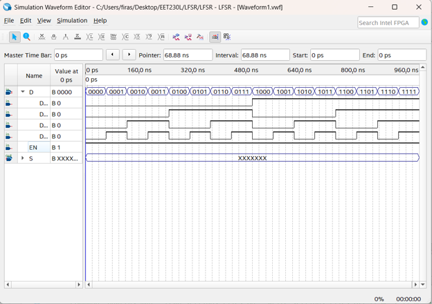

### Completed Display Simulation

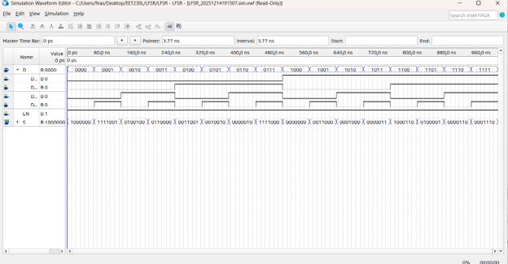

The resulting `S[6..0]` values were compared with the VHDL decoding table.

---

# Part 3 – LFSRDisplay Module

## Purpose

After verifying the LFSR and Display driver independently, both modules were combined.

The resulting schematic is:

```text
LFSRDisplay.bdf
```

The signal flow is:

```text
CLK + CNT
    |
    v
+---------+
|  LFSR   |
+----+----+
     |
     v
   D[3..0]
     |
     v
+---------+
| Display |
+----+----+
     |
     v
   S[6..0]
```

---

# LFSRDisplay Schematic

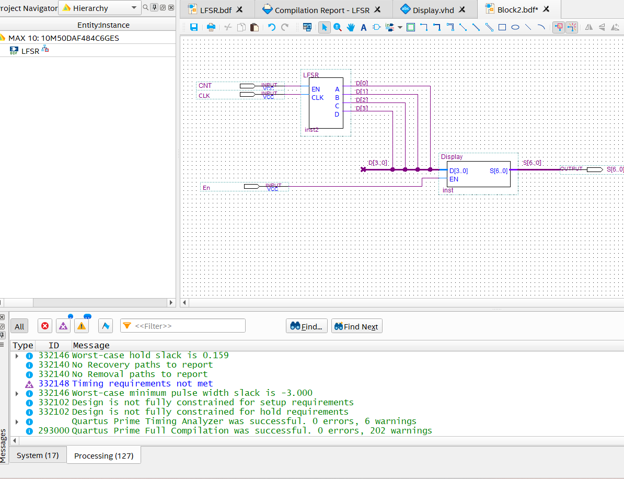

The combined subsystem converts each pseudo-random 4-bit LFSR output directly into a hexadecimal 7-segment pattern.

---

# Part 4 – Johnson Counter

## Purpose

A Johnson counter is used to sequentially enable the display positions.

A Johnson counter is a shift-register-based sequential circuit in which the inverted output of the final stage is fed back to the beginning of the register.

The resulting sequence provides controlled output states that can be used to select individual display positions.

---

# Johnson Counter Architecture

Conceptually:

```text
       +-----+    +-----+    +-----+    +-----+
CLK -->| FF0 |--->| FF1 |--->| FF2 |--->| FF3 |
       +--+--+    +-----+    +-----+    +--+--+
          ^                               |
          |                               |
          +----------- NOT ---------------+
```

This structure generates a predictable sequential enable pattern.

---

# Johnson Counter Design

The Johnson counter schematic is stored in:

```text
Johnson.bdf
```

A generated symbol is stored in:

```text
Johnson.bsf
```

---

# Johnson Compilation

The Johnson subsystem was compiled independently before final integration.

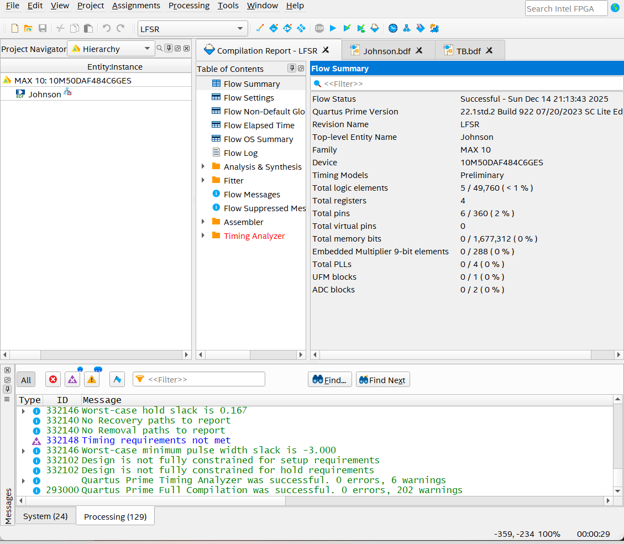

This verifies the counter before it is used to control the display sequence.

---

# Johnson Functional Simulation

A waveform was used to verify sequential output behavior.

The simulation uses:

```text
CLK
EN
Q0
Q1
Q2
Q3
```

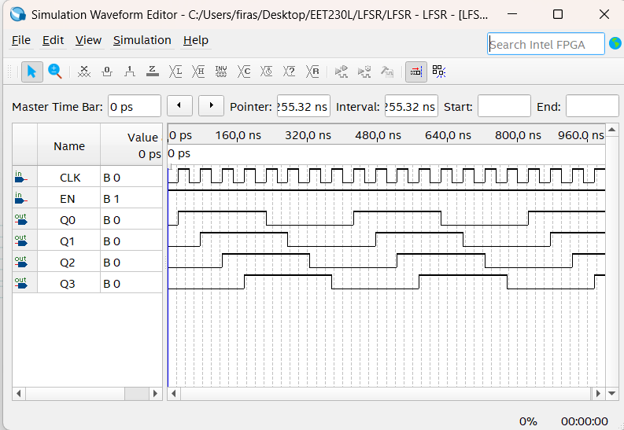

The waveform demonstrates the expected sequential state progression of the counter outputs.

---

# Part 5 – Final Integrated Design

The final top-level schematic is:

```text
TB.bdf
```

The final system combines:

- LFSR
- Hexadecimal display driver
- Johnson counter
- Display sequencing logic
- Clock-divider functionality
- FPGA display outputs

The onboard clock allows the display system to operate automatically rather than requiring manual clock pulses.

---

# Final TB Schematic

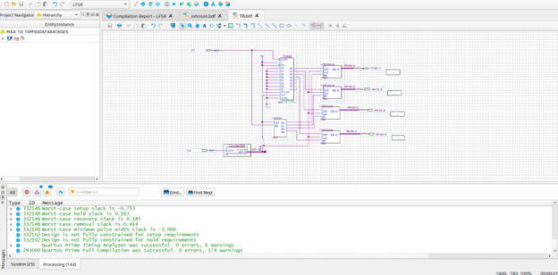

The top-level design distributes pseudo-random hexadecimal information across the display system while the Johnson counter controls the scrolling sequence.

---

# Final Compilation

The complete system was compiled after all modules were integrated.

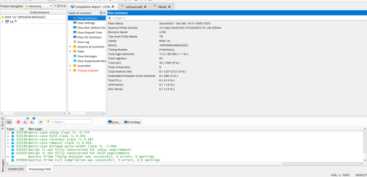

The final design targets:

```text
FPGA Family: MAX 10
Device: 10M50DAF484C6GES
```

The successful compilation verifies that the hierarchical system is valid for FPGA implementation.

---

# FPGA Pin Assignment

Quartus Pin Planner was used to connect the logical display outputs and control signals to the physical DE10-Lite FPGA pins.

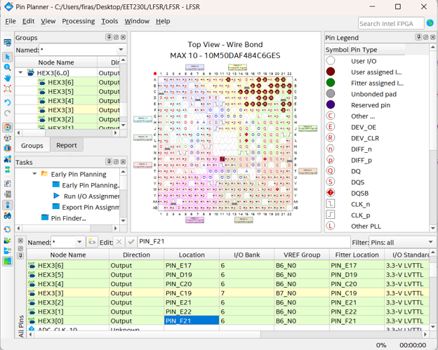

The output pins are configured using the appropriate DE10-Lite display assignments and:

```text
3.3-V LVTTL
```

I/O standards.

---

# FPGA Programming

After successful compilation, Quartus Programmer was used to load the design onto the physical DE10-Lite board.

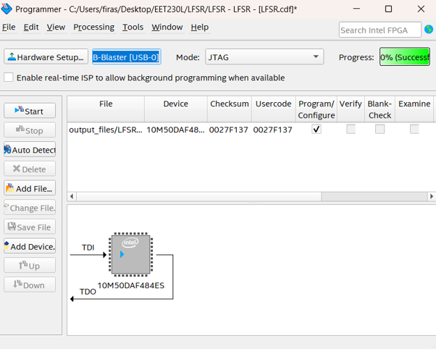

Programming configuration:

```text
Hardware: USB-Blaster
Mode: JTAG
Target: Intel MAX 10 FPGA
```

---

# Hardware Enable

The completed design uses:

```text
SW4
```

as the hardware enable control.

When SW4 enables the system, the FPGA begins the automatic random scrolling sequence.

---

# Automatic Clocking

The final system uses the DE10-Lite onboard clock.

A slower clock is derived from the high-frequency system clock so that the scrolling behavior can be observed visually.

This eliminates the need to manually clock every display transition.

---

# Random Scrolling Operation

The final system performs the following continuous process:

```text
Generate LFSR Value
        |
        v
Convert to Hex Character
        |
        v
Display Character
        |
        v
Johnson Counter Advances
        |
        v
Move Display Position
        |
        v
Continue Scrolling
        |
        v
Generate New Random Value
        |
        v
Repeat
```

---

# Hardware Demonstration

The physical DE10-Lite implementation is located in:

[Hardware Demonstration](Hardware/)

Direct video:

[View DE10-Lite LFSR Random Scrolling Display Demo](Hardware/DE10-Lite-LFSR-Random-Scrolling-Display-Demo.mp4)

---

# Complete Engineering Workflow

```text
Design LFSR
      |
      v
Compile LFSR
      |
      v
Simulate Random Sequence
      |
      v
Create Display.vhd
      |
      v
Compile Display Driver
      |
      v
Simulate 0-F Decoder
      |
      v
Create LFSRDisplay
      |
      v
Generate Combined Symbol
      |
      v
Design Johnson Counter
      |
      v
Simulate Johnson Sequence
      |
      v
Create Final TB Design
      |
      v
Integrate Clock Divider
      |
      v
Assign FPGA Pins
      |
      v
Compile Complete Design
      |
      v
USB-Blaster / JTAG
      |
      v
Program DE10-Lite
      |
      v
Enable with SW4
      |
      v
Observe Automatic Random Scrolling
```

---

# Project Files

## Quartus Source Files

The source files are located in:

[Quartus Source Files](Quartus/)

Important files include:

| File | Purpose |
|---|---|
| `LFSR.qpf` | Main Quartus project |
| `LFSR.qsf` | Project configuration and pin assignments |
| `LFSR.bdf` | Linear Feedback Shift Register design |
| `LFSR.bsf` | LFSR reusable symbol |
| `Display.vhd` | Hexadecimal 7-segment decoder |
| `Display.bsf` | Display-driver symbol |
| `LFSRDisplay.bdf` | Combined LFSR/display module |
| `LFSRDisplay.bsf` | Combined reusable symbol |
| `Johnson.bdf` | Johnson counter |
| `Johnson.bsf` | Johnson counter symbol |
| `TB.bdf` | Final integrated FPGA design |
| `Waveform.vwf` | Simulation waveform |
| `Waveform1.vwf` | Simulation waveform |
| `Waveform2.vwf` | Simulation waveform |
| `DE10_LITE_Golden_Top.v` | DE10-Lite reference source |

---

# Screenshots

Development screenshots are located in:

[Project Screenshots](Screenshots/)

---

# Hardware Demonstration

The physical FPGA demonstration is located in:

[Hardware Demonstration](Hardware/)

---

# Skills Demonstrated

## FPGA Development

- FPGA Architecture
- Intel MAX 10
- Terasic DE10-Lite
- Hierarchical FPGA Design
- Digital I/O
- FPGA Programming

## Sequential Logic

- Linear Feedback Shift Registers
- Pseudo-Random Sequence Generation
- Shift Registers
- Johnson Counters
- Clocked Sequential Logic
- Feedback Logic
- XOR Logic

## VHDL

- VHDL Design
- Combinational Logic
- Hexadecimal Decoding
- 7-Segment Display Drivers
- HDL Integration

## Display Systems

- 7-Segment Displays
- Hexadecimal Character Generation
- Display Sequencing
- Scrolling Displays
- Multi-Display Control

## Quartus Prime Lite

- Block Diagram/Schematic Editor
- VHDL Integration
- Symbol Generation
- Simulation Waveform Editor
- Pin Planner
- Compilation
- Quartus Programmer

## Engineering

- Modular Design
- Hierarchical System Integration
- Simulation
- Functional Verification
- Troubleshooting
- Hardware/Software Integration
- Physical FPGA Validation
- Technical Documentation

---

# What I Learned

This project brought together several digital-system concepts into one complete FPGA application.

I gained practical experience designing and verifying a Linear Feedback Shift Register for pseudo-random number generation and learned how feedback logic can create a sequence fundamentally different from a standard binary counter.

I also expanded a VHDL 7-segment display decoder so that it supports the complete hexadecimal range from 0 through F.

The Johnson counter provided additional experience with shift-register-based sequential logic and demonstrated how sequential enable signals can control multiple display positions.

Combining the LFSR, display driver, Johnson counter, clock system, and physical displays reinforced the importance of modular FPGA development. Each subsystem was developed and verified independently before being incorporated into the final design.

The project also provided experience progressing from mathematical and logical design concepts through simulation, hierarchical integration, FPGA pin mapping, compilation, programming, and physical hardware testing.

---

# Conclusion

Project 007 demonstrates the implementation of a pseudo-random scrolling hexadecimal display system using Intel Quartus Prime Lite and the Terasic DE10-Lite FPGA board.

The design combines an LFSR pseudo-random generator, VHDL hexadecimal display driver, Johnson counter, hierarchical schematics, clocked sequential logic, and physical 7-segment displays.

The completed project provides practical evidence of experience with **LFSRs, pseudo-random sequence generation, VHDL, Johnson counters, shift registers, hexadecimal decoding, FPGA hierarchy, simulation, FPGA programming, and physical digital-system verification**.
