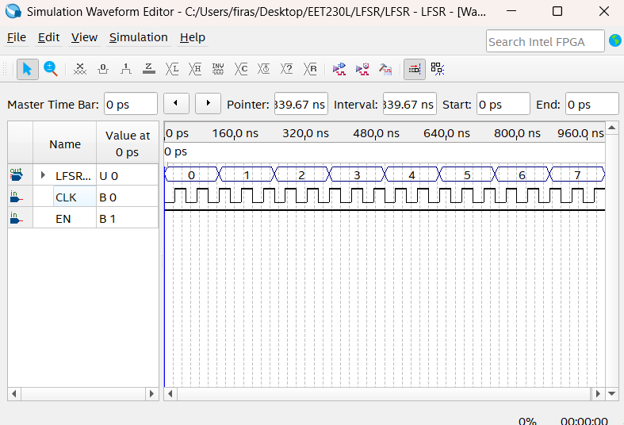
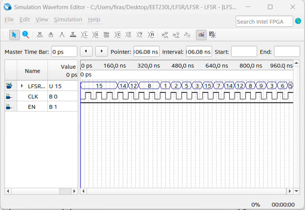

# Project 007 – FPGA Development Screenshots

## Overview

This folder contains fifteen screenshots documenting the design, simulation, integration, compilation, pin-assignment, and FPGA-programming stages of **Project 007 – FPGA LFSR Random Scrolling Display**.

The screenshots provide visual evidence of the progression from individual digital subsystems to the final integrated DE10-Lite implementation.

---

# Screenshot 1 – LFSR Schematic

## File

`Picture1.png`


## Description

This screenshot shows the Linear Feedback Shift Register schematic developed in Quartus Prime Lite.

The design uses sequential flip-flop stages and XOR feedback to generate a pseudo-random 4-bit sequence.

The primary control signals are:

```text
CLK
EN
```

The LFSR serves as the random-data generator for the final display system.

---

# Screenshot 2 – LFSR Compilation

## File

`Picture2.png`


## Description

This screenshot shows the Quartus Flow Summary for the LFSR subsystem.

The compilation stage verifies the feedback logic, flip-flop connectivity, and device compatibility before simulation.

---

# Screenshot 3 – LFSR Timing Setup

## File

`Picture3.png`



## Description

This screenshot shows a waveform configuration used to test the LFSR.

The clock and enable signals are configured so that the shift register advances through its pseudo-random sequence.

---

# Screenshot 4 – LFSR Random Sequence

## File

`Picture4.png`



## Description

This screenshot shows the LFSR output grouped as an unsigned value.

The resulting values demonstrate a pseudo-random state sequence rather than a conventional binary count.

This provides functional verification of the Linear Feedback Shift Register.

---

# Screenshot 5 – Additional LFSR Verification

## File

`Picture5.png`


## Description

This screenshot provides additional waveform evidence of the LFSR state progression and clocked pseudo-random operation.

The sequence demonstrates that the feedback network continuously generates new 4-bit states.

---

# Screenshot 6 – Display VHDL Source

## File

`Picture6.png`


## Description

This screenshot shows the `Display.vhd` source code.

The VHDL module converts all sixteen 4-bit input combinations into the appropriate seven-segment patterns.

Supported characters include:

```text
0 1 2 3 4 5 6 7
8 9 A b C d E F
```

---

# Screenshot 7 – Display Waveform Setup

## File

`Picture7.png`


## Description

This screenshot shows the initial simulation configuration for the hexadecimal display driver.

The primary signals are:

```text
D[3..0]
EN
S[6..0]
```

The test setup is used to exercise the complete hexadecimal input range.

---

# Screenshot 8 – Display Simulation Results

## File

`Picture8.png`


## Description

This screenshot shows the completed display-driver simulation.

The input progresses through different 4-bit combinations while `S[6..0]` produces the corresponding segment patterns.

The simulation verifies the `Display.vhd` hexadecimal decoding logic.

---

# Screenshot 9 – LFSRDisplay Integration

## File

`Picture9.png`


## Description

This screenshot shows the combined `LFSRDisplay.bdf` module.

The design connects:

```text
LFSR
  |
  v
D[3..0]
  |
  v
Display
  |
  v
S[6..0]
```

This stage converts pseudo-random binary values directly into hexadecimal display patterns.

---

# Screenshot 10 – Johnson Counter Simulation

## File

`Picture10.png`


## Description

This screenshot shows the Johnson counter waveform.

The outputs change sequentially in response to the clock while the enable input is active.

The waveform verifies the display-sequencing logic before final integration.

---

# Screenshot 11 – Johnson Counter Compilation

## File

`Picture11.png`


## Description

This screenshot shows the Quartus Flow Summary for the Johnson counter.

The subsystem was compiled and verified independently before being incorporated into the final system.

---

# Screenshot 12 – Final Integrated TB Schematic

## File

`Picture12.png`


## Description

This screenshot shows the complete top-level FPGA design.

The final architecture integrates:

- Pseudo-random LFSR logic
- Hexadecimal display decoding
- Johnson counter sequencing
- Display-control logic
- Automatic clocking

The design represents the complete scrolling-display system before physical implementation.

---

# Screenshot 13 – Final Compilation Report

## File

`Picture13.png`


## Description

This screenshot shows the Quartus Flow Summary for the final integrated FPGA design.

The project targets:

```text
FPGA Family: MAX 10
Device: 10M50DAF484C6GES
```

Successful compilation verifies that the complete hierarchical design can be implemented on the DE10-Lite FPGA.

---

# Screenshot 14 – FPGA Pin Planner

## File

`Picture14.png`


## Description

This screenshot shows Quartus Pin Planner.

The logical output signals are mapped to the physical MAX 10 FPGA pins connected to the DE10-Lite 7-segment displays and control inputs.

This stage connects the software-defined FPGA logic to the actual hardware resources.

---

# Screenshot 15 – Quartus Programmer

## File

`Picture15.png`


## Description

This screenshot shows Quartus Programmer configured to transfer the completed design to the DE10-Lite board.

Programming configuration:

```text
Hardware: USB-Blaster
Mode: JTAG
Target: Intel MAX 10
```

This represents the final transition from Quartus development to physical FPGA implementation.

---

# Screenshot Summary

| Screenshot | Development Stage |
|---|---|
| `Picture1.png` | LFSR schematic |
| `Picture2.png` | LFSR compilation |
| `Picture3.png` | LFSR waveform configuration |
| `Picture4.png` | LFSR pseudo-random output |
| `Picture5.png` | Additional LFSR verification |
| `Picture6.png` | Display VHDL source |
| `Picture7.png` | Display waveform setup |
| `Picture8.png` | Display simulation results |
| `Picture9.png` | LFSRDisplay integration |
| `Picture10.png` | Johnson counter simulation |
| `Picture11.png` | Johnson compilation |
| `Picture12.png` | Final TB schematic |
| `Picture13.png` | Final compilation |
| `Picture14.png` | FPGA pin assignments |
| `Picture15.png` | FPGA programming |

---

# Complete Visual Workflow

```text
LFSR Design
     |
     v
LFSR Compilation
     |
     v
LFSR Simulation
     |
     v
Pseudo-Random Verification
     |
     v
Display VHDL
     |
     v
Display Simulation
     |
     v
LFSRDisplay Integration
     |
     v
Johnson Counter
     |
     v
Johnson Verification
     |
     v
Final TB Integration
     |
     v
Final Compilation
     |
     v
Pin Assignment
     |
     v
Quartus Programmer
     |
     v
DE10-Lite Hardware
```

---

# Related Project Sections

Main project:

```text
../README.md
```

Quartus source files:

```text
../Quartus/
```

Hardware demonstration:

```text
../Hardware/
```

---

# Purpose

This folder provides visual evidence of the complete development process behind Project 007.

Together with the Quartus source files and hardware demonstration, the screenshots document pseudo-random sequence generation, VHDL display decoding, Johnson counter design, functional simulation, hierarchical integration, FPGA configuration, and physical implementation.
